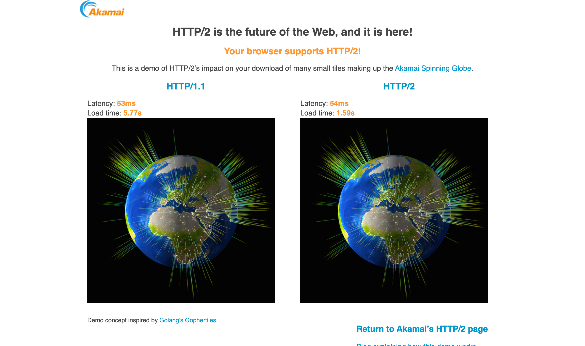

# HTTP协议总结

### 概念

HTTP，即超文本传输协议，用于从www服务器传输超文本到本地浏览器的传送协议。

### 特点

1. 基于TCP/IP协议来传递数据
2. 属于OSI七层模型的应用层，OSI七层从下网上依次为物理层、数据链路层、网络层、传输层、会话层、表示层、应用层
3. 工作于C/S架构上。浏览器作为HTTP客户端通过URL向HTTP服务端即WEB服务器发送所有请求
4. 无连接：无连接的含义是限制每次连接只处理一个请求。服务器处理完客户的请求，并收到客户的应答后，即断开连接。早期这样设计是为了尽快释放资源以服务其他客户端，后来由于页面复杂化，每次连接tcp很低效，HTTP/1.1添加了「Connection:Keep-Alive」请求头，支持了长连接，避免了重新建立连接，缺点是影响服务器性能。
5. 无状态：HTTP协议是无状态协议。无状态是指协议对于事务处理没有记忆能力。优点是解放服务器，缺点是每次请求要带很多重复信息。两种方案解决，一个是 Cookie，而另一个则是 Session。
6. 媒体独立，只要客户端和服务器知道如何处理的数据内容，任何类型的数据都可以通过HTTP发送。客户端以及服务器指定使用适合的MIME-type内容类型。

### 工作原理

1. 建立TCP连接，通过TCP/IP协议
2. 客户端向服务端发送请求
3. 服务端响应请求
4. 服务端向客户端返回请求
5. 根据是否长连接选择保持连接还是断开


### 消息结构

请求报文：

1. 请求行：包含请求的方法，请求的URL和请求的HTTP版本
2. 请求首部字段：从客户端向服务器端发送请求报文是使用的首部。补充说明了请求的附加内容、客户端信息、响应内容优先级等信息。
3. 通用首部字段：请求报文和响应报文都会用到的首部
4. 实体首部字段：针对请求报文和响应报文实体部分使用的字段。补充说明了资源内容、更新时间等与实体有关的信息。
5. 其他：如set-cookies等非Http协议的请求头
6. 空行：[CR+LF]由它来划分
7. 报文主体：请求数据（并不一定要有报文主体）


示例:

```html
GET /test.txt HTTP/1.1
User-Agent: curl/7.16.3 libcurl/7.16.3 OpenSSL/0.9.7l zlib/1.2.3
Host: www.google.com
Accept-Language: en, mi
...
```

应答报文：

1. 状态行：包含Http版本号，响应结果状态码和原因语句
2. 响应首部字段：从服务器向客户端返回响应豹纹是使用的首部。补充说明了响应的附加内容，也会要求客户端附加额外的内容信息 。
3. 通用首部字段：同上
4. 实体首部字段：同上
5. 其他：同上
6. 空行：同上
7. 报文主体：同上

示例：

```
HTTP/1.1 200 OK
Date: Mon, 27 Jul 2009 12:28:53 GMT
Server: Apache
Last-Modified: Wed, 22 Jul 2009 19:15:56 GMT
ETag: "34aa387-d-1568eb00"
Accept-Ranges: bytes
Content-Length: 51
Vary: Accept-Encoding
Content-Type: text/plain

...
```


### HTTP/1.1  更新内容

1. 1.1支持长连接，在请求头中添加了「Connection: Keep-Alive」来告诉服务端保持连接
2. 1.0中认为每台机器只有一个IP，因此，请求消息中的URL并没有传递主机名。1.1请求消息和响应消息都应支持Host头域，如果没有会报错（400 Bad Request）
3. 1.1添加了状态码100，使客户端可以只发送请求头而不发送报文主体
4. Chunked transfer-coding：发送时将消息划分为几个数据块，结束时以一个空块结尾 
5. 缓存处理：HTTP1.1则引入了更多的缓存控制策略例如Entity tag，If-Unmodified-Since, If-Match, If-None-Match等更多可供选择的缓存头来控制缓存策略


### HTTP/2.0 更新内容

HTTP/2.0是SPDY的升级版，SPDY是google优化了HTTP/1.x的请求方案，SPDY位于HTTP之下，TCP和SSL之上，SPDY后被HTTP/2.0替代。

共同特性：

**Header压缩**

HTTP2.0使用encoder来减少需要传输的header大小，通讯双方各自缓存一份header fields表，差量更新HTTP头部，大大降低因头部传输产生的流量。

**多路复用**

即连接共享，每一个request都是是用作连接共享机制的。一个request对应一个id，这样一个连接上可以有多个request，每个连接的request可以随机的混杂在一起，接收方可以根据request的 id将request再归属到各自不同的服务端请求里面。

HTTP 性能优化的关键并不在于高带宽，而是低延迟。TCP 连接会随着时间进行自我「调谐」，起初会限制连接的最大速度，如果数据成功传输，会随着时间的推移提高传输的速度。这种调节则被称为 TCP 慢启动。由于这种原因，让原本就具有突发性和短时性的 HTTP 连接变的十分低效。
HTTP/2 通过让所有数据流共用同一个连接，可以更有效地使用 TCP 连接，让高带宽也能真正的服务于 HTTP 的性能提升。

**服务器推送**

服务端推送能把客户端所需要的资源伴随着index.html一起发送到客户端，省去了客户端重复请求的步骤。正因为没有发起请求，建立连接等操作，所以静态资源通过服务端推送的方式可以极大地提升速度。


**HTTP2.0和SPDY的区别(了解)：**

1. HTTP/2.0 支持明文 HTTP 传输，而 SPDY 强制使用 HTTPS
2. HTTP/2.0 消息头的压缩算法采用 **HPACK** http://http2.github.io/http2-spec/compression.html，而非 SPDY 采用的 **DEFLATE** http://zh.wikipedia.org/wiki/DEFLATE

> DEFLATE是同时使用了LZ77算法与哈夫曼编码（Huffman Coding）的一个无损数据压缩算法。


**HTTP2.0的多路复用和HTTP1.X中的长连接复用有什么区别？**

- HTTP/1.* 一次请求-响应，建立一个连接，用完关闭；每一个请求都要建立一个连接；
- HTTP/1.1 Pipeling解决方式为，若干个请求排队串行化单线程处理，后面的请求等待前面请求的返回才能获得执行机会，一旦有某请求超时等，后续请求只能被阻塞，毫无办法，也就是人们常说的线头阻塞；
- HTTP/2多个请求可同时在一个连接上并行执行。某个请求任务耗时严重，不会影响到其它连接的正常执行；
  

### 总结

|                     | HTTP1.0                     | HTTP1.1                                | HTTP2.0  |
| :------------------ | :-------------------------- | :------------------------------------- | :------- |
| Host头域            | ✗                           | ✔                                      | ✔        |
| Range头（断点续传） | ✗                           | ✔                                      | ✔        |
| 长连接              | ✗                           | ✔                                      | ✔        |
| request method      | GET POST HEAD               | 以上+ OPTIONS PUT DELETE TRACE CONNECT | 以上全部 |
| cache               | Expire Last-Modefied Pragma | 以上+Entity tag Cache-Control          | 以上全部 |
| header压缩          | ✗                           | ✗                                      | ✔        |
| 多路复用            | ✗                           | ✗                                      | ✔        |
| 服务器推送          | ✗                           | ✗                                      | ✔        |


[https://http2.akamai.com/demo](https://http2.akamai.com/demo) 是Akamai公司建立的一个官方演示，我们可以很明显的看出HTTP2.0对HTTP1.1上的性能提升。




# 其他

### Cookie与Session的区别

- cookie存放于客户端，session存放于服务器
- cookie不安全，session安全
- session会在服务器保存一段时间，访问量大的话，会影响服务器性能
- 单个cookie保存的数据不能超过4K，浏览器都限制cookie数量
- 域的支持范围不一样

### HTTP与HTTPS的区别

- HTTPS协议需要到CA申请证书，一般免费证书很少，需要交费。
- HTTP协议运行在TCP之上，所有传输的内容都是明文，HTTPS运行在SSL/TLS之上，SSL/TLS运行在TCP之上，所有传输的内容都经过加密的。
- HTTP和HTTPS使用的是完全不同的连接方式，用的端口也不一样，前者是80，后者是443。
- HTTPS可以有效的防止运营商劫持，解决了防劫持的一个大问题。