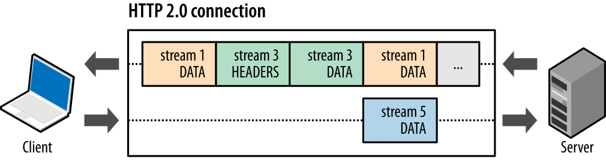

# HTTP协议总结

> 所有内容均来自网上，这里只是整理。

## 概念

HTTP（全称：Hyper Text Transfer Protocol），即超文本传输协议，用于从www服务器传输超文本到本地浏览器的传送协议。

## 特点

1. 目前是基于TCP/IP协议来传递数据。原因：HTTP只需要传输层协议是可靠且不丢失消息的，TCP是可靠的，而UDP不是，因此HTTP依赖于面向连接的TCP协议。
2. 基于OSI七层模型的应用层，OSI七层从下网上依次为物理层、数据链路层、网络层、传输层、会话层、表示层、应用层。
3. 工作于C/S架构上。浏览器作为HTTP客户端通过URL向HTTP服务端即WEB服务器发送所有请求
4. 无连接，1.0：无连接的含义是限制每次连接只处理一个请求。服务器处理完客户的请求，并收到客户的应答后，即断开连接。早期这样设计是为了尽快释放资源以服务其他客户端，后来由于页面复杂化，每次连接tcp很低效和资源的浪费，HTTP/1.1添加了「Connection:Keep-Alive」请求头，支持了长连接，避免了重新建立连接，缺点是影响服务器性能。HTTP/2.0更新了多路复用，极大的提升了性能。
5. 无状态，1.0：HTTP协议是无状态协议。无状态是指协议对于事务处理没有记忆能力。优点是解放服务器，缺点是每次请求要带很多重复信息。两种方案解决，一个是 Cookie，而另一个则是 Session。
6. 媒体独立，只要客户端和服务器知道如何处理的数据内容，任何类型的数据都可以通过HTTP发送。客户端以及服务器指定使用适合的MIME-type内容类型。


> 图片来源网上


## 工作原理

1. 建立TCP连接
2. 客户端向服务端发送请求，一个HTTP报文：HTTP报文（在HTTP/2之前）是语义可读的。在HTTP/2中，这些简单的消息被封装在了帧中，这使得报文不能被直接读取，但是原理仍是相同的。
4. 服务端向客户端返回请求，客户端解析报文消息
5. 根据是否长连接选择保持连接还是断开

## 消息结构

### 请求报文

1. 请求行：包含请求的方法，请求的URL和请求的HTTP版本
2. 请求首部字段：从客户端向服务器端发送请求报文是使用的首部。补充说明了请求的附加内容、客户端信息、响应内容优先级等信息。
   1. Accept 该字段可通知服务器，用户代理能够处理的媒体类型及媒体类型的相对优先级。可使用type/subtype这种形式，一次指定多种媒体类型。
   2. Accept-Charset 用来通知服务器用户代理支持的字符集及字符集的相对优先顺序。它可以一次性指定多个字符集。
   3. Accept-Encoding 用来告知服务器用户代理支持的内容编码及内容编码的优先级顺序。可一次性指定多种内容编码。
   4. Accept-Language 用来通知服务器用户代理能够处理的自然语言集（中文或英文）等，以及自然语言集的相对优先级。可一次指定多种自然语言集。
   5. Authorization  用来通知服务器，用户代理的认证信息。
   6. Expect  客户端使用首部字段Expect来告知服务器，期望出现的某种特定行为。因服务器无法理解客户端的期望作出回应而发生错误时，会返回状态码417Expectation Failed。
   7. From 用来告知服务器使用用户代理的用户的电子邮件地址。
   8. Host  虚拟主机运行在同一个IP上，因此使用首部字段Host加以区分，HTTP/1.1引入。
   9. User-Agent 表示客户端代理，使得服务器能够识别客户使用的操作系统及版本、CPU 类型、浏览器及版本、浏览器渲染引擎、浏览器语言、浏览器插件等。
   10. ...
3. 通用首部字段：请求报文和响应报文都会用到的首部，例如
   1. Cache-Control 能操作缓存的工作机制
   2. Connection 管理持久连接，Keep-Alive，close
   3. Date 表明创建 HTTP 报文的日期和时间。
   4. Transfer-Encoding 规定了传输报文主体时采用的编码方式。
   5. Warning 告知用户一些与缓存相关的问题的警告。
4. 实体首部字段：实体首部字段是包含在请求报文和响应报文中的实体部分所使用的首部。补充说明了资源内容、更新时间等与实体有关的信息。
   1. Allow     该首部字段用于告知客户端能够支持Request-URI指定资源的所有HTTP方法。
   2. Content-Encoding     该首部字段用于告知客户端服务器对实体主体部分选用的内容编码方式。
   3. Content-Language     该首部字段会告知客户端，实体主体使用的自然语言。
   4. Content-Length 该首部字段表明了实体主体部分的大小，单位是字节。对实体主体进行编码传输时，不能再使用该字段。
   5. Content-Location 使用该字段给出报文主体部分相对应的URI。和首部字段Location不同的是，该字段表示的是报文主体返回资源对应的URI。
   6. Content-Range 范围
   7. Content-Type 该首部字段说明了实体主体内对象的媒体类型。和首部字段Accept一样，字段值使用了type/subtype形式赋值。
   8. Expires 该首部字段会将资源失效的日期告知客户端。
   9. Last-Modified      该首部字段会指明资源最后修改的时间。
5. 其他：如set-cookies等非Http协议的请求头
6. 空行：[CR+LF]由它来划分
7. 报文主体：请求数据（并不一定要有报文主体，例如GET,HEAD,DELETE,OPTIONS等请求），Body大致可以分为两类：
   - Single-resource body，该类型body由两个header定义：Content-Type和 Content-Length
   - Multiple-resource bodies，由多部分 body 组成，每一部分包含不同的信息位


示例:

```html
GET /test.txt HTTP/1.1
User-Agent: curl/7.16.3 libcurl/7.16.3 OpenSSL/0.9.7l zlib/1.2.3
Host: www.google.com
Accept-Language: en, mi
...
```

### 应答报文

1. 状态行：包含Http版本号，响应结果状态码和原因语句
1. 状态代码为3位数字，200~299的状态码表示成功，300~399的状态码指资源重定向，400~499的状态码指客户端请求出错，500~599的状态码指服务端出错（HTTP/1.1向协议中引入了信息性状态码，范围为100~199）
2. 响应首部字段：从服务器向客户端返回响应报文是使用的首部。补充说明了响应的附加内容，也会要求客户端附加额外的内容信息 。

   1. Accept-Ranges  首部字段Accept-Ranges 是用来告知客户端服务器是否能处理范围请求，以指定获取服务端某个部分资源。
   2. Age 首部字段Age能告知客户端，原服务器在多久前创建了响应，字段值的单位为秒；
      若创建该响应的服务器是缓存服务器，Age值是指缓存后的响应再次发起认证到认证完成的时间值。
   3. ETag  首部字段ETag能告知客户端实体标志。他是一种可将资源以字符串形式做惟一标志的方式。服务器会将每份资源分配对应的ETag值，ETag值分为：强ETag值 和 弱ETag值
      强ETag值：不论实体发生多么细微的变化都会改变其值
      弱ETag值：只用于提示资源是否相同。只有资源发生了根本性的变化，产生差异时才会改变ETag值。这时，会在字段最开始处附加W/
   4. Location 首部字段Location 可以将响应接收方引导至某个与请求URI位置不同的资源，基本上，该字段会配合3XX：Redirection 的响应，提供重定向的URI
   5. Proxy-Authenticate 首部字段Proxy-Authenticate会把由代理服务器所要求的认证信息发送给客户端
   6. Server 首部字段Serve告知客户端当前服务器上安装的HTTP服务器应用程序的信息，如服务器上的软件应用名称
   7. Vary 大部分情况下是用在客户端缓存机制或者是缓存服务器在做缓存操作的时候，会使用到Vary头，会读取响应头中的Vary的内容，进行一些缓存的判断。Vary头的内容来自于当前请求的Request头部Key，比如Accept-Encoding、User-Agent等。
3. 通用首部字段：请求报文和响应报文都会用到的首部
4. 实体首部字段：针对请求报文和响应报文实体部分使用的字段。补充说明了资源内容、更新时间等与实体有关的信息。
5. 其他：同上
6. 空行：同上
8. 报文主体：响应数据（状态码201/401等没有body），body通常三类：
   - Single-resource bodies，由**已知**长度的单个文件组成。该类型 body 由两个 header 定义：Content-Type和 Content-Length
   - Single-resource bodies，由**未知**长度的单个文件组成，通过将 Transfer-Encoding 设置为 `chunked `来使用 chunks 编码
   - Multiple-resource bodies，由多部分 body 组成，每部分包含不同的信息段。但这是比较少见的


示例：

```
HTTP/1.1 200 OK
Date: Mon, 27 Jul 2009 12:28:53 GMT
Server: Apache
Last-Modified: Wed, 22 Jul 2009 19:15:56 GMT
ETag: "34aa387-d-1568eb00"
Accept-Ranges: bytes
Content-Length: 51
Vary: Accept-Encoding
Content-Type: text/plain

...
```


### RFC

> 请求意见稿（英語：Request for Comments，縮寫：RFC）是由互联网工程任务组（IETF）发布的一系列備忘錄。 文件收集了有關網際網路相關資訊，以及UNIX和網際網路社群的軟體文件，以編號排定。 目前RFC文件是由網際網路協會（ISOC）贊助發行。
>
> https://zh.wikipedia.org/zh-hans/RFC

### MIME

**媒体类型**（通常称为 **Multipurpose Internet Mail Extensions** 或 **MIME** 类型 ）是一种标准，用来表示文档、文件或字节流的性质和格式。它在[IETF RFC 6838](https://tools.ietf.org/html/rfc6838)中进行了定义和标准化。

客户端通过MIME TYPE告知服务端资源的媒体类型从而区分它们，决定什么内容用什么形式显示

> https://developer.mozilla.org/zh-CN/docs/Web/HTTP/Basics_of_HTTP/MIME_types


### Content-Disposition

1. 在常规的HTTP应答中，`Content-Disposition` 响应头指示回复的内容该以何种形式展示，是以**内联**的形式（即网页或者页面的一部分），还是以**附件**的形式下载并保存到本地。

   > Content-Disposition: inline
   > Content-Disposition: attachment
   > Content-Disposition: attachment; filename="filename.jpg"
   >
   > 第一个参数或者是inline（默认值，表示回复中的消息体会以页面的一部分或者整个页面的形式展示），或者是attachment（意味着消息体应该被下载到本地；大多数浏览器会呈现一个“保存为”的对话框，将filename的值预填为下载后的文件名，假如它存在的话）。

   示例：

   ```html
   200 OK
   Content-Type: text/html; charset=utf-8
   Content-Disposition: attachment; filename="cool.html"
   Content-Length: 22
   
   <HTML>Save me!</HTML>
   ```
   
   这个简单的HTML文件会被下载到本地而不是在浏览器中展示。大多数浏览器默认会建议将`cool.html`作为文件名。


2. 在multipart/form-data类型的应答消息体中， **Content-Disposition** 消息头可以被用在multipart消息体的子部分中，用来给出其对应字段的相关信息。各个子部分由在`Content-Type` 中定义的**分隔符**分隔。用在消息体自身则无实际意义。

   > Content-Disposition: form-data
   > Content-Disposition: form-data; name="fieldName"
   > Content-Disposition: form-data; name="fieldName"; filename="filename.jpg"
   >
   > 第一个参数总是固定不变的`form-data`；附加的参数不区分大小写，并且拥有参数值，参数名与参数值用等号(=)连接，参数值用双引号括起来。参数之间用分号(;)分隔。
   
   示例：
   
   ```html
   POST /test.html HTTP/1.1
   Host: example.org
   Content-Type: multipart/form-data;boundary=boundary
   
   --boundary
   Content-Disposition: form-data; name="field1"
   
   value1
   --boundary
   Content-Disposition: form-data; name="field2"; filename="example.txt"
   
   value2
   --boundary--
   ```
   
   以上是一个HTML表单的示例，展示了在 `multipart/form-data` format 格式的报文中使用`Content-Disposition` 消息头的情况
   
   Content-Disposition消息头最初是在MIME标准中定义的，HTTP表单及`POST`请求只用到了其所有参数的一个子集。只有`form-data`以及可选的`name`和`filename`三个参数可以应用在HTTP场景中。

`name`：一个表单字段名的字符串，每一个字段名会对应一个子部分。在同一个字段名对应多个文件的情况下（例如，带有`multiple` 属性的`<input type=file>`元素），则多个子部分共用同一个字段名。如果name参数的值为 `'_charset_'` ，意味着这个子部分表示的不是一个HTML字段，而是在未明确指定字符集信息的情况下各部分使用的默认字符集。

`filename`：要传送的文件的初始名称，可选，路径信息必须舍掉。这个参数主要用来提供展示性信息，当与 `Content-Disposition: attachment` 一同使用的时候，它被用作"保存为"对话框中呈现给用户的默认文件名。

> https://developer.mozilla.org/zh-CN/docs/Web/HTTP/Headers/Content-Disposition
>


### Keep-Alive

`Keep-Alive` 是一个通用消息头，允许消息发送者暗示连接的状态，还可以用来设置超时时长和最大请求数。

需要将`Connection` 首部的值设置为  "keep-alive" 这个首部才有意义。同时需要注意的是，在HTTP/2 协议中， `Connection` 和 `Keep-Alive`  是被忽略的；在其中采用其他机制来进行连接管理。

```
HTTP/1.1 200 OK
Connection: Keep-Alive
Content-Encoding: gzip
Content-Type: text/html; charset=utf-8
Date: Thu, 11 Aug 2016 15:23:13 GMT
Keep-Alive: timeout=5, max=1000
Last-Modified: Mon, 25 Jul 2016 04:32:39 GMT
Server: Apache

(body)
```

- `timeout`：指定了一个空闲连接需要保持打开状态的最小时长（以秒为单位）。需要注意的是，如果没有在传输层设置 keep-alive TCP message 的话，大于 TCP 层面的超时设置会被忽略。
- `max`：在连接关闭之前，在此连接可以发送的请求的最大值。在非管道连接中，除了 0 以外，这个值是被忽略的，因为需要在紧跟着的响应中发送新一次的请求。HTTP 管道连接则可以用它来限制管道的使用。

> https://developer.mozilla.org/zh-CN/docs/Web/HTTP/Headers/Keep-Alive

> 其他header https://developer.mozilla.org/zh-CN/docs/Web/HTTP/Headers


## 请求method

HTTP 1.0 定义了三种请求方法：GET、POST和HEAD。

HTTP 1.1 新增五种请求方法：OPTIONS、PUT、PATCH、DELETE、TRACE和CONNECT。

### GET

类似SQL中的Select

获取被请求URI指定的信息，该信息以实体的形式返回。

- 参数可见，明文在URL中
- 数据类型只允许ASCII，不能传递二进制文件
- URL长度受浏览器限制

| 请求是否有主体       | 否   |
| :------------------- | ---- |
| 成功的响应是否有主体 | 是   |
| 安全                 | 是   |
| 幂等                 | 是   |
| 可缓存               | 是   |
| HTML 表单是否支持    | 是   |

### POST

类似SQL中的Insert

发送数据给服务器，请求主体的类型由 `Content-Type` 首部指定.。通常用于提交表单或者上传文件，数据被包含在请求体中。Post请求可能创建新资源或者修改已有资源。

- `application/``x-www-form-urlencoded`: 数据被编码成以 `'&'` 分隔的键-值对, 同时以 `'='` 分隔键和值. 非字母或数字的字符会被 [percent-encoding](https://developer.mozilla.org/en-US/docs/Glossary/percent-encoding): 这也就是为什么这种类型不支持二进制数据(应使用 `multipart/form-data` 代替).
- `multipart/form-data`
- `text/plain`

特点

- 参数不可见，也不会被保存
- 不限制请求长度
- 数据类型不限
- POST 请求与 GET 请求不同，他会首先提交 HEAD 信息，待得到 100 响应后，才会再次将 DATA 提交

| 请求是否有主体       | 是                                        |
| :------------------- | ----------------------------------------- |
| 成功的响应是否有主体 | 是                                        |
| 安全                 | 否                                        |
| 幂等                 | 否                                        |
| 可缓存               | Only if freshness information is included |
| HTML 表单是否支持    | 是                                        |

e.g.

POST请求

```
POST /contact_form.php HTTP/1.1
Host: developer.mozilla.org
Content-Length: 64
Content-Type: application/x-www-form-urlencoded

name=Joe%20User&request=Send%20me%20one%20of%20your%20catalogue
```

POST上传

```
POST / HTTP/1.1
Host: developer.mozilla.org
Accept: text/html,application/xhtml+xml,application/xml;q=0.9,*/*;q=0.8
Accept-Language: en-US,en;q=0.5
Accept-Encoding: gzip, deflate
Connection: keep-alive
Content-Type: multipart/form-data; boundary=boundary
Content-Length: 12345

--boundary
Content-Disposition: form-data; name="myCheckBox"

on
--boundary
Content-Disposition: form-data; name="myImg"; filename="test.jpg"
Content-Type: application/octet-stream
Content-Transfer-Encoding: binary

二进制数据。。。
--boundary--
```


### HEAD

类似GET，但服务器只返回首部，不会返回实体的主体部分。一个使用场景是在下载一个大文件前先获取其大小再决定是否要下载, 以此可以节约带宽资源.。

| 请求是否有正文                                               | 否   |
| :----------------------------------------------------------- | ---- |
| 成功的响应是否有正文                                         | 否   |
| 安全                                                         | 是   |
| 幂等 | 是   |
| 可缓存                                                       | 是   |
| HTML 表单 是否支持 | 否   |

```
curl -X HEAD https://github.com -i

HTTP/1.1 200 OK
Server: GitHub.com
Date: Tue, 24 Dec 2019 06:40:03 GMT
Content-Type: text/html; charset=utf-8
Status: 200 OK
Vary: X-PJAX
ETag: W/"460c48c36eebf1f8b4ab84bf83525fb2"
Cache-Control: max-age=0, private, must-revalidate
...
```


### OPTIONS

| 请求是否有正文       | 否   |
| :------------------- | ---- |
| 成功的响应是否有正文 | 否   |
| 安全                 | 是   |
| 幂等                 | 是   |
| 可缓存               | 否   |
| HTML 表单 是否支持   | 否   |

1. 获取服务器支持的HTTP请求方法

2. 检查服务器的功能(能力)，如果 OPTIONS 请求的 URI 是个星号(*)，请求的就是整个服务器所支持的功能。

   例如：

   ```
   OPTIONS * HTTP/1.1
   Host: www.test.com
   Accept: *
   ```

   如果 URI 是个实际资源地址，OPTIONS 请求就是在查询那个特定资源的可用特性:

   ```
   curl -X OPTIONS https://www.bilibili.com/ -i
   
HTTP/1.1 200 OK
   Date: Tue, 24 Dec 2019 06:37:20 GMT
Content-Type: text/plain; charset=utf-8
   Content-Length: 0
   Connection: keep-alive
   Cache-Control: max-age=30
   Allow: HEAD, GET
   Vary: Origin,Accept-Encoding
IDC: shjd
   Expires: Tue, 24 Dec 2019 06:37:50 GMT
   X-Cache-Webcdn: BYPASS from hw-bj4-webcdn-08
   ```
   
   HTTP/1.1 在响应中唯一 指定的首部字段是 Allow 首部，这个首部用于描述服务器所支持的各种方法(或者 服务器上的特定资源)
   
   > options 使用场景
   >
   > https://developer.mozilla.org/zh-CN/docs/Web/HTTP/Access_control_CORS   「预检请求」部分
   >
   > https://developer.mozilla.org/zh-CN/docs/Web/HTTP/Methods/OPTIONS


### PUT

类似SQL中的Update，但是是整体全部update

| 请求是否有正文       | 是   |
| :------------------- | ---- |
| 成功的响应是否有正文 | 否   |
| 安全                 | 否   |
| 幂等                 | 是   |
| 可缓存               | 否   |
| HTML 表单 是否支持   | 否   |

与post区别在于，put是幂等的，post调用多次可能带来副作用。

> https://developer.mozilla.org/zh-CN/docs/Web/HTTP/Methods/PUT

### PATCH

蕾丝SQL中的Update，但是是部分update

| 请求是否有正文       | 是   |
| :------------------- | ---- |
| 成功的响应是否有正文 | 否   |
| 安全                 | 否   |
| 幂等                 | 否   |
| 可缓存               | 否   |
| HTML 表单 是否支持   | 否   |

PATCH方法出现的较晚，它在2010年的 [RFC 5789 PATCH Method for HTTP](https://tools.ietf.org/html/rfc5789) 标准中被定义。PATCH请求与PUT请求类似，同样用于资源的更新。二者有以下两点不同：

- PATCH一般用于资源的部分更新，而PUT一般用于资源的整体更新。假设有个UserInfo，包含 userId, userName等多个字段。要更新userName，使用PUT，则需要传一个完整的userInfo，使用PATCH，则可以只传一个userName去更新。
- 当资源不存在时，PUT会创建一个新的资源，而PATCH只会对已在资源进行更新。


### DELETE

类似SQL中的Delete

一般用于删除资源。客户端不能保证删除操作一定执行，因为 HTTP 规范允许服务 器在不通知客户端的情况下撤销请求。

| 请求是否有主体         | 可以有 |
| :--------------------- | ------ |
| 成功的返回是否有主体   | 可以有 |
| 安全                   | 否     |
| 幂等                   | 是     |
| 可缓存                 | 否     |
| 可以在HTML forms中使用 | 否     |

### TRACE

| 请求是否有主体          | 否   |
| :---------------------- | ---- |
| 成功的返回是否有主体    | 否   |
| 安全                    | 否   |
| 幂等                    | 是   |
| 可缓存                  | 否   |
| 可以在HTML  forms中使用 | 否   |

回显服务器收到的请求，通常用于测试或诊断。

客户端发起一个请求时，这个请求可能要穿过防火墙、代理、网关或其他一些应用程序。每个中间节点都可能会修改原始的 HTTP 请求。TRACE 方法允许客户端在最终将请求发送给服务器时，查看它变成了什么样子。

TRACE 请求中不能带有实体的主体部分。TRACE 响应的实体主体部分包含了响应服务器收到的请求的精确副本。

当 TRACE 响应到达时，客户端可以检查服务器收到的确切报文，以及它所经过的代理列表(在 Via 首部)。TRACE 响应的 `Content-Type` 为 `message/http`，状态为 `200 OK`。

Via 首部字段包含一个由逗号分隔的 `路标(waypoint)`。每个路标都表示一个独立的 代理服务器或网关，且包含与那个中间节点的协议和地址有关的信息。下面是一个 带有两个路标的 Via 首部实例:

```
Via = 1.1 cache.joes-hardware.com, 1.1 proxy.irenes-isp.net
```

每个 Via 路标中最多包含 4 个组件:一个可选的协议名(默认为 HTTP)、一 个必选的协议版本、一个必选的节点名和一个可选的描述性注释。

### CONNECT

在 HTTP 协议中，**CONNECT** 方法可以开启一个客户端与所请求资源之间的双向沟通的通道。它可以用来创建隧道（tunnel）。

例如，**CONNECT** 可以用来访问采用了 [SSL](https://developer.mozilla.org/en-US/docs/Glossary/SSL) ([HTTPS](https://developer.mozilla.org/en-US/docs/Glossary/HTTPS))  协议的站点。客户端要求代理服务器将 TCP 连接作为通往目的主机隧道。之后该服务器会代替客户端与目的主机建立连接。连接建立好之后，代理服务器会面向客户端发送或接收 TCP 消息流。

`CONNECT` 是一个应用范围为点到点的方法。

| 请求是否有主体         | 否   |
| :--------------------- | ---- |
| 成功的返回是否有主体   | 是   |
| 安全                   | 否   |
| 幂等                   | 否   |
| 可缓存                 | 否   |
| 可以在HTML forms中使用 | 否   |

## HTTP连接

> https://developer.mozilla.org/zh-CN/docs/Web/HTTP/Connection_management_in_HTTP_1.x

在 HTTP/1.x 里有多种模型：*短连接*, *长连接*, 和 *HTTP 流水线*。

### 短连接

HTTP/1.0 的默认模型，是短连接。每一个 HTTP 请求都由它自己独立的连接完成。

缺点：

- 创建新连接太耗时
- TCP性能连接只有在被使用了一段时间后才能得到改善（热连接）

### 长连接

HTTP/1.1 的默认模型，是长连接。一个长连接会保持一段时间，重复用于发送一系列请求，节省了新建 TCP 连接握手的时间，还可以利用 TCP 的性能增强能力。

缺点：

- 空闲时占用资源（服务器可以使用 [`Keep-Alive`](https://developer.mozilla.org/zh-CN/docs/Web/HTTP/Headers/Keep-Alive) 协议头来指定一个最小的连接保持时间）

### HTTP Pipeline

仅HTTP/1.1支持，1.0不支持

Pipeling：

1. 多个HTTP请求通过一个TCP链接发送，且下一个http请求发送前不需要等待上一个请求的应答
2. 服务器必须按照与接收到的请求相同的顺序发送相关的应答
3. 先进先出，可以发生阻塞（某一个请求发生阻塞，会阻塞该请求后面所有请求的应答）
4. HTTP Pipeline要求客户端和服务端同时都支持pipeline
5. 非幂等性请求不应该使用pipeline（非强制）


## HTTP 访问控制

> https://developer.mozilla.org/zh-CN/docs/Web/HTTP/Access_control_CORS


## HTTP 状态码

HTTP 响应状态代码指示特定 HTTP 请求是否已成功完成。响应分为五类：

- 信息响应(`100`–`199`)
- 成功响应(`200`–`299`)
- 重定向(`300`–`399`)
- 客户端错误(`400`–`499`)
- 服务器错误 (`500`–`599`)

# HTTP发展

> https://developer.mozilla.org/zh-CN/docs/Web/HTTP/Basics_of_HTTP/Evolution_of_HTTP

## HTTP/0.9 - 单行协议

0.9的构成较简单，由单行指令构成：

```
GET /mypage.html
```

只响应文档本身：

```
<HTML>
这是一个非常简单的HTML页面
</HTML>
```


## HTTP/1.0 - 构建可扩展性

- 协议版本信息现在会随着每个请求发送（`HTTP/1.0`被追加到了`GET`行）。
- 状态码会在响应开始时发送，使浏览器能了解请求执行成功或失败，并相应调整行为（如更新或使用本地缓存）。
- 引入了HTTP头的概念，无论是对于请求还是响应，允许传输元数据，使协议变得非常灵活，更具扩展性。
- 在新HTTP头的帮助下，具备了传输除纯文本HTML文件以外其他类型文档的能力（感谢[`Content-Type`](https://developer.mozilla.org/zh-CN/docs/Web/HTTP/Headers/Content-Type)头）。


## HTTP/1.1 - 标准化协议

- 连接可以复用，节省了多次打开TCP连接加载网页文档资源的时间。
- 增加流水线操作，允许在第一个应答被完全发送之前就发送第二个请求，以降低通信延迟。
- 支持响应分块。
- 引入额外的缓存控制机制。
- 引入内容协商机制，包括语言，编码，类型等，并允许客户端和服务器之间约定以最合适的内容进行交换。
- 感谢[`Host`](https://developer.mozilla.org/zh-CN/docs/Web/HTTP/Headers/Host)头，能够使不同域名配置在同一个IP地址的服务器上。


## HTTP/2.0 

HTTP/2.0是SPDY的升级版，SPDY是google优化了HTTP/1.x的请求方案，SPDY位于HTTP之下，TCP和SSL之上，SPDY是HTTP/2的基础。

HTTP/2在HTTP/1.1有几处基本的不同:

- HTTP/2是二进制协议而不是文本协议。不再可读，也不可无障碍的手动创建，改善的优化技术现在可被实施。
- 这是一个复用协议。并行的请求能在同一个链接中处理，移除了HTTP/1.x中顺序和阻塞的约束。
- 压缩了headers。因为headers在一系列请求中常常是相似的，其移除了重复和传输重复数据的成本。
- 其允许服务器在客户端缓存中填充数据，通过一个叫服务器推送的机制来提前请求。

HTTP/1.x 报文有一些性能上的缺点：

- Header 不像 body，它不会被压缩。
- 两个报文之间的 header 通常非常相似，但它们仍然在连接中重复传输。
- 无法复用。当在同一个服务器打开几个连接时：TCP 热连接比冷连接更加有效。

HTTP/2 引入了一个额外的步骤：它将 HTTP/1.x 消息分成帧并嵌入到流 (stream) 中。数据帧和报头帧分离，这将允许报头压缩。将多个流组合，这是一个被称为*多路复用 (multiplexing)* 的过程，它允许更有效的底层 TCP 连接。

### Header压缩

HTTP/2 客户端和服务端约定编码，将header压缩来减少需要传输的header大小，大大降低因头部传输产生的流量。

HTTP/2 使用 HPACK 压缩格式压缩请求和响应标头元数据，这种格式采用两种简单但是强大的技术：

1. 这种格式支持通过静态霍夫曼代码对传输的标头字段进行编码，从而减小了各个传输的大小。
2. 这种格式要求客户端和服务器同时维护和更新一个包含之前见过的标头字段的索引列表（换句话说，它可以建立一个共享的压缩上下文），此列表随后会用作参考，对之前传输的值进行有效编码。

### 多路复用（multiplexing）

即连接共享，每一个request都是是用作连接共享机制的。一个request对应一个id，这样一个连接上可以有多个request，每个连接的request可以随机的混杂在一起，接收方可以根据request的 id将request再归属到各自不同的服务端请求里面。

HTTP 性能优化的关键并不在于高带宽，而是低延迟。TCP 连接会随着时间进行自我「调谐」，起初会限制连接的最大速度，如果数据成功传输，会随着时间的推移提高传输的速度。这种调节则被称为 TCP 慢启动。由于这种原因，让原本就具有突发性和短时性的 HTTP 连接变的十分低效。

HTTP/2 通过让所有数据流共用同一个连接，可以更有效地使用 TCP 连接，让高带宽也能真正的服务于 HTTP 的性能提升。

#### 实现基础

**帧**

HTTP/2是一个二进制协议，相较于HTTP/1.x，它多了一个二进制分帧层，所有的消息被拆分封装成更小的消息单元帧，并进行二进制编码。

其中http1.x的首部信息被封装成HEADER帧和CONTINUATION帧，请求体被封装到DATA帧。如下：


> https://developers.google.com/web/fundamentals/performance/http2

帧格式如下图所示，包含长度、类型、标志、Stream ID、数据这几个字段。长度是24位无符号整形，默认14位，超过2^14=16384需要通过SETTINGS帧设置。

```
 +-----------------------------------------------+
 |                 Length (24)                   |
 +---------------+---------------+---------------+
 |   Type (8)    |   Flags (8)   |
 +-+-------------+---------------+-------------------------------+
 |R|                 Stream Identifier (31)                      |
 +=+=============================================================+
 |                   Frame Payload (0...)                      ...
 +---------------------------------------------------------------+
```

> https://http2.github.io/http2-spec/

帧由Frame Header和Frame Payload组成，Frame Header由固定的9字节（Length+Type+Flags+Stream Identifier）呈现。变化的为帧的负载(Frame Payload)，负载内容是由帧类型（Type）定义。每个字段含义：

| 名称              | 长度   | 描述                                                         |
| :---------------- | :----- | :----------------------------------------------------------- |
| Length            | 3 字节 | 表示Frame Payload的长度，默认最大帧大小2^14，超过后将不被发送除非由SETTINGS_MAX_FRAME_SIZE字段指定 |
| Type              | 1 字节 | 当前帧的类型，定义了Frame Payload的具体格式和帧的语义        |
| Flags             | 1 字节 | 具体帧的标识，默认值为0x0。                                  |
| R                 | 1 字节 | 在HTTP/2语境下为保留的比特位，固定值为0X0                    |
| Stream Identifier | 31 位  | 每个流的唯一ID，表示为无符号的31位整数。0x0值表示为帧仅作用于连接，不隶属于单独的流。 |
| Frame Payload     | 不固定 | 真实帧的内容，真实长度在Length中设置                         |

HTTP/2中有10种不同的帧类型：

| 名称          | ID   | 描述                                   |
| :------------ | :--- | :------------------------------------- |
| DATA          | 0x0  | 传输流的核心内容                       |
| HEADERS       | 0x1  | 包含HTTP首部，和可选的优先级参数       |
| PRIORITY      | 0x2  | 指示或者更改流的优先级和依赖           |
| RST_STREAM    | 0x3  | 允许一端停止流（通常是由于错误导致的） |
| SETTINGS      | 0x4  | 协商连接级参数                         |
| PUSH_PROMISE  | 0x5  | 提示客户端，服务端要推送些东西         |
| PING          | 0x6  | 测试连接可用性和往返时延（RTT）        |
| GOAWAY        | 0x7  | 告诉另外一端，当前端已结束             |
| WINDOW_UPDATE | 0x8  | 协商一端要接收多少字节（用于流量控制） |
| CONTINUATION  | 0x9  | 用以拓展HEADER数据块                   |

**流**

新的二进制分帧机制改变了客户端与服务器之间交换数据的方式。

- 数据流：已建立的连接内的双向字节流，可以承载一条或多条消息。
- 消息：与逻辑请求或响应消息对应的完整的一系列帧。
- 帧：HTTP/2 通信的最小单位，每个帧都包含帧头，至少也会标识出当前帧所属的数据流。

三者的关系总结为：

- 所有通信都在一个 TCP 连接上完成，此连接可以承载任意数量的双向数据流。
- 每个数据流都有一个唯一的标识符和可选的优先级信息，用于承载双向消息。
- 每条消息都是一条逻辑 HTTP 消息（例如请求或响应），包含一个或多个帧。
- 帧是最小的通信单位，承载着特定类型的数据，例如 HTTP 标头、消息负载等等。 来自不同数据流的帧可以交错发送，然后再根据每个帧头的数据流标识符重新组装。

HTTP/2 将 HTTP 协议通信分解为二进制编码帧的交换，这些帧对应着特定数据流中的消息。所有这些都在一个 TCP 连接内复用。 这是 HTTP/2 协议所有其他功能和性能优化的基础。


> https://developers.google.com/web/fundamentals/performance/http2

**多路复用**

HTTP/2 中新的二进制分帧层带来了完整的请求和响应复用：客户端和服务器可以将 HTTP 消息分解为互不依赖的帧，然后交错发送，最后再在另一端把它们重新组装起来。

如图， 客户端正在向服务器传输一个 `DATA` 帧（数据流 5），与此同时，服务器正向客户端交错发送数据流 1 和数据流 3 的一系列帧。因此，一个连接上同时有三个并行数据流。



> https://developers.google.com/web/fundamentals/performance/http2


将消息分解为独立的帧，交错发送，这个机制带来了巨大的性能提升：

- 并行交错地发送多个请求，请求之间互不影响。
- 并行交错地发送多个响应，响应之间互不干扰。
- 使用一个连接并行发送多个请求和响应。
- 不必再为绕过 HTTP/1.x 限制而做很多工作
- 消除不必要的延迟和提高现有网络容量的利用率，从而减少页面加载时间。


### HTTP2.0的多路复用和HTTP1.X中的长连接复用有什么区别？

为什么HTTP/1.1不能多路复用？

因为HTTP/2是基于二进制“帧”的协议，HTTP/1.1是基于“文本分割”的解析协议。例如

```
GET /test.txt HTTP/1.1
User-Agent: curl/7.16.3 libcurl/7.16.3 OpenSSL/0.9.7l zlib/1.2.3
Host: www.google.com
Accept-Language: en, mi
...
```

以上，以换行符为分界线，服务端需要不断的读取，然后分割，这就导致了它的缺点

- HTTP/1.* 一次请求-响应，建立一个连接，用完关闭；每一个请求都要建立一个连接；

- HTTP/1.1 Pipeling解决方式为：

  1. 多个HTTP请求通过一个TCP链接发送，且下一个http请求发送前不需要等待上一个请求的应答
  2. 服务器必须按照与接收到的请求相同的顺序发送相关的应答
  3. 先进先出，可以发生阻塞（某一个请求发生阻塞，会阻塞该请求后面所有请求的应答）
  4. HTTP Pipeline要求客户端和服务端同时都支持pipeline
  5. 非幂等性请求不应该使用pipeline（非强制）

  

**为什么使用二进制协议**

1. 性能。二进制协议的解析效率超高，几乎没有解析代价
2. 带宽。二进制协议没有冗余字段，占用带宽少
3. 压缩及HTTPS弱化了文本协议的价值

> 文本协议就是在进行网络传输时，传输的是类似JSON，XML这样的文本文件，而不是二进制文件。
>
> 文本协议优点：
>
> 1. 可读性好，便于调试
> 2. 扩展性也好，方便兼容旧协议
>
> 缺点：
>
> 1. 解析效率一般，需要进行字符串比对；
> 2. 存在冗余字段，体积大
>
> 二进制协议是旨在由机器而不是人类读取的协议，意思就是在进行网络传输时传输的不是类似JSON这样的文本文件，而是01这样的二进制数据。
>
> 判断一个协议是否是文本协议，与它在网络模型的上下层无关，止与自身有关。
>
> 二进制协议优点：
>
> 1. 解析效率超高，几乎没有解析代价
> 2. 没有冗余字段，体积小
>
> 缺点：
>
> 1. 可读性差，难于调试
> 2. 扩展性不好 ，如果要扩展字段，旧版协议就不兼容了


### 服务器推送

服务端推送能把客户端所需要的资源伴随着index.html一起发送到客户端，省去了客户端重复请求的步骤。正因为没有发起请求，建立连接等操作，所以静态资源通过服务端推送的方式可以极大地提升速度。

**服务器推送功能之前**

1. 首先浏览器请求主页面index.html，服务端响应内容
2. 获取到主页应答，浏览器开始解析主页的html标签，发现构建DOM树还需要CSS, GIF, JS等资源
3. 发起针对CSS,GIF,JS的内容请求
4. 获取并解析JS和CSS等内容, 然后继续请求依赖资源

**服务器推送功能之后**

1. 首先浏览器请求主页面index.html，服务端响应内容
2. 服务器主动并发推送依赖资源至浏览器

### 其他特性

- 流量控制
- 设置资源优先级和依赖关系

## HTTP2.0和SPDY的区别(了解)：

1. HTTP/2.0 支持明文 HTTP 传输，而 SPDY 强制使用 HTTPS
2. HTTP/2.0 消息头的压缩算法采用 **HPACK** http://http2.github.io/http2-spec/compression.html，而非 SPDY 采用的 **DEFLATE** http://zh.wikipedia.org/wiki/DEFLATE

> DEFLATE是同时使用了LZ77算法与哈夫曼编码（Huffman Coding）的一个无损数据压缩算法。
>
> HPACK：客户端和服务器端共同维护一个静态字典


## 1.0、1.1、2.0区别

|                     | HTTP1.0                     | HTTP1.1                                | HTTP2.0  |
| :------------------ | :-------------------------- | :------------------------------------- | :------- |
| Host头域            | ✗                           | ✔                                      | ✔        |
| Range头（断点续传） | ✗                           | ✔                                      | ✔        |
| 长连接              | ✗                           | ✔                                      | ✔        |
| request method      | GET POST HEAD               | 以上+ OPTIONS PUT DELETE TRACE CONNECT | 以上全部 |
| cache               | Expire Last-Modefied Pragma | 以上+ETag Cache-Control                | 以上全部 |
| header压缩          | ✗                           | ✗                                      | ✔        |
| 多路复用            | ✗                           | ✗                                      | ✔        |
| 服务器推送          | ✗                           | ✗                                      | ✔        |


[https://http2.akamai.com/demo](https://http2.akamai.com/demo) 是Akamai公司建立的一个官方演示，我们可以很明显的看出HTTP2.0对HTTP1.1上的性能提升。


## 其他

**Cookie与Session的区别**

- cookie存放于客户端，session存放于服务器
- cookie不安全，session安全
- session会在服务器保存一段时间，访问量大的话，会影响服务器性能
- 单个cookie保存的数据不能超过4K，浏览器都限制cookie数量
- 域的支持范围不一样

**HTTP的缺点**

- 通信使用明文，不安全
- 没有验证通信方的身份，因此有可能遭遇伪装
- 没有验证文件的完整性


# HTTPS

## 概念

HTTPS（全称：Hyper Text Transfer Protocol over SecureSocket Layer）即 HTTP+TSL，是HTTP的升级版协议，经由HTTP进行通信，利用SSL/TLS建立全信道，加密数据包。HTTPS使用的主要目的是提供对网站服务器的身份认证，同时保护交换数据的隐私与完整性。

## HTTPS特点

- 内容加密，采用混合加密技术，中间人无法查看内容
- 验证身份，通过证书认证客户端访问的是自己的服务器
- 保证文件的完整性

> **混合加密：**结合非对称加密和对称加密技术。
>
> 1. 客户端使用对称加密生成密钥对传输数据进行加密
>
> 2. 然后使用非对称加密的公钥再对秘钥进行加密
>
>    网络上传输的数据是被秘钥加密的密文和用公钥加密后的秘密秘钥，因此即使被黑客截取，由于没有私钥，无法获取到加密明文的秘钥，便无法获取到明文数据。
>
> **数字摘要：**通过单向hash函数对原文进行哈希，将需加密的明文“摘要”成一串固定长度(如128bit)的密文，不同的明文摘要成的密文其结果总是不相同，同样的明文其摘要必定一致，并且即使知道了摘要也不能反推出明文。
>
> **数字签名技术：**数字签名建立在公钥加密体制基础上，是公钥加密技术的另一类应用。它把公钥加密技术和数字摘要结合起来，形成了实用的数字签名技术。

## 工作原理

HTTPS在传输数据之前需要客户端与服务端之间进行一次握手，在握手过程中将确立双方加密传输数据的密码信息。TLS/SSL协议中使用了非对称加密，对称加密以及HASH算法。具体过程如下：

1. 客户端向服务端发起请求，端口443，请求携带客户端支持的HASH算法和加密算法
2. 服务端收到请求，选择客户端支持的HASH算法和加密算法
3. 服务端将非对称加密算法生成的公钥和证书下发给客户端，证书可以是CA的，也可以是自制的。
4. 客户端收到响应后认真证书，在TLS这一层完成：
   - 验证证书的合法性（办法证书的机构是否合法，地址是否一致等），是从客户端内置的证书列表中索引的
   - 如果合法，用机构的证书公钥解密，得到证书内容和证书签名，内容包括服务端的地址、服务端的公钥、证书的有效期等。
   - 验证证书签名是否合法（数据完整性），地址是否一致，是否在有效期内，这些都通过后，就可以使用服务端的公钥
5. 客户端生成一个随机数R，然后使用服务端的公钥对R加密得到E-R
6. 客户端将E-R发送给服务端
7. 服务端使用私钥解密E-R得到R，R即客户端和服务端进行对称加密的密钥
8. 客户端对发送内容content作Hash算法，得到数字摘要HC
9. 客户端用公钥对数字摘要HC作加密，得到数字签名HC-S
10. 客户端对发送内容content作对称加密得到RC
11. 客户端发送RC，HC-S到服务端
12. 服务端用私钥解密HC-S，得到HC
13. 服务端用对称加密，解密内容RC，得到C
14. 服务端对C作Hash算法，得到HC1
15. 服务端验证HC1，HC，如果相等，则数据完整，如果不等，则数据损坏


> 非对称加密算法：RSA，DSA
> 对称加密算法：AES，RC4，3DES 
> HASH算法：MD5，SHA-1，SHA-2，SHA-3，SHA256等等

> 因为非对称加密计算量较大，整个通信过程只会用到一次非对称加密，主要用来保护客户端生成的随机密钥R，后续内容都是通过对称算法进行。

> SSL/TLS是HTTPS安全性的核心模块，TLS的前身是SSL，TLS1.0就是SSL3.1，TLS1.1是SSL3.2，TLS1.2则是SSL3.3。 SSL/TLS是建立在TCP协议之上，因而也是应用层级别的协议。其包括TLS Record Protocol和TLS Handshaking Protocols两个模块，后者负责握手过程中的身份认证，前者则保证数据传输过程中的完整性和私密性。

> CA，即Certificate Authority，权威机构，一切的信任机制都是基于CA，如果CA的私钥泄露或者信任了一个错误的CA，那么HTTPS的安全性就不复存在了

## HTTP与HTTPS的区别

- HTTPS协议需要到CA申请证书，一般免费证书很少，需要交费。
- HTTP协议运行在TCP之上，所有传输的内容都是明文，HTTPS运行在SSL/TLS之上，SSL/TLS运行在TCP之上，所有传输的内容都经过加密的。
- HTTP和HTTPS使用的是完全不同的连接方式，用的端口也不一样，前者是80，后者是443。
- HTTPS可以有效的防止运营商劫持，解决了防劫持的一个大问题。

## HTTPS的待改进

- 技术方面
  - HTTPS协议会使页面的加载时间延长近50%，增加10%到20%的耗电。此外，HTTPS协议还会影响缓存，增加数据开销和功耗。
  - 安全是有范围的，在黑客攻击、拒绝服务攻击、服务器劫持等方面几乎起不到什么作用
  - HTTPS协议还会影响缓存，增加数据开销和功耗，甚至已有安全措施也会受到影响也会因此而受到影响。
  - SSL证书的信用链体系并不安全，特别是在某些国家可以控制CA根证书的情况下，中间人攻击一样可行。
- 成本
  - SSL的专业证书需要购买，功能越强大的证书费用越高。个人网站、小网站可以选择入门级免费证书
  - SSL 证书通常需要绑定 固定IP，为服务器增加固定IP会增加一定费用
  - HTTPS 连接服务器端资源占用高较高多，相同负载下会增加带宽和服务器投入成本

