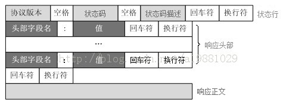

# HTTP协议总结

### 概念

HTTP（全称：Hyper Text Transfer Protocol），即超文本传输协议，用于从www服务器传输超文本到本地浏览器的传送协议。

### 特点

1. 基于TCP/IP协议来传递数据
2. 属于OSI七层模型的应用层，OSI七层从下网上依次为物理层、数据链路层、网络层、传输层、会话层、表示层、应用层
3. 工作于C/S架构上。浏览器作为HTTP客户端通过URL向HTTP服务端即WEB服务器发送所有请求
4. 无连接，1.0：无连接的含义是限制每次连接只处理一个请求。服务器处理完客户的请求，并收到客户的应答后，即断开连接。早期这样设计是为了尽快释放资源以服务其他客户端，后来由于页面复杂化，每次连接tcp很低效和资源的浪费，HTTP/1.1添加了「Connection:Keep-Alive」请求头，支持了长连接，避免了重新建立连接，缺点是影响服务器性能。HTTP/2.0更新了多路复用，极大的提升了性能。
5. 无状态，1.0：HTTP协议是无状态协议。无状态是指协议对于事务处理没有记忆能力。优点是解放服务器，缺点是每次请求要带很多重复信息。两种方案解决，一个是 Cookie，而另一个则是 Session。
6. 媒体独立，只要客户端和服务器知道如何处理的数据内容，任何类型的数据都可以通过HTTP发送。客户端以及服务器指定使用适合的MIME-type内容类型。


> 图片来源网上

### 工作原理

1. 建立TCP连接，通过TCP/IP协议
2. 客户端向服务端发送请求
3. 服务端响应请求
4. 服务端向客户端返回请求
5. 根据是否长连接选择保持连接还是断开


### 消息结构

请求报文：

1. 请求行：包含请求的方法，请求的URL和请求的HTTP版本
2. 请求首部字段：从客户端向服务器端发送请求报文是使用的首部。补充说明了请求的附加内容、客户端信息、响应内容优先级等信息。
   1. Accept 该字段可通知服务器，用户代理能够处理的媒体类型及媒体类型的相对优先级。可使用type/subtype这种形式，一次指定多种媒体类型。
   2. Accept-Charset 用来通知服务器用户代理支持的字符集及字符集的相对优先顺序。它可以一次性指定多个字符集。
   3. Accept-Encoding 用来告知服务器用户代理支持的内容编码及内容编码的优先级顺序。可一次性指定多种内容编码。
   4. Accept-Language 用来通知服务器用户代理能够处理的自然语言集（中文或英文）等，以及自然语言集的相对优先级。可一次指定多种自然语言集。
   5. Authorization  用来通知服务器，用户代理的认证信息。
   6. Expect  客户端使用首部字段Expect来告知服务器，期望出现的某种特定行为。因服务器无法理解客户端的期望作出回应而发生错误时，会返回状态码417Expectation Failed。
   7. From 用来告知服务器使用用户代理的用户的电子邮件地址。
   8. Host  虚拟主机运行在同一个IP上，因此使用首部字段Host加以区分，HTTP/1.1引入。
   9. User-Agent 表示客户端代理，使得服务器能够识别客户使用的操作系统及版本、CPU 类型、浏览器及版本、浏览器渲染引擎、浏览器语言、浏览器插件等。
   10. ...
3. 通用首部字段：请求报文和响应报文都会用到的首部，例如
   1. Cache-Control 能操作缓存的工作机制
   2. Connection 管理持久连接，Keep-Alive，close
   3. Date 表明创建 HTTP 报文的日期和时间。
   4. Transfer-Encoding 规定了传输报文主体时采用的编码方式。
   5. Warning 告知用户一些与缓存相关的问题的警告。
4. 实体首部字段：实体首部字段是包含在请求报文和响应报文中的实体部分所使用的首部。补充说明了资源内容、更新时间等与实体有关的信息。
   1. Allow     该首部字段用于告知客户端能够支持Request-URI指定资源的所有HTTP方法。
   2. Content-Encoding     该首部字段用于告知客户端服务器对实体主体部分选用的内容编码方式。
   3. Content-Language     该首部字段会告知客户端，实体主体使用的自然语言。
   4. Content-Length 该首部字段表明了实体主体部分的大小，单位是字节。对实体主体进行编码传输时，不能再使用该字段。
   5. Content-Location 使用该字段给出报文主体部分相对应的URI。和首部字段Location不同的是，该字段表示的是报文主体返回资源对应的URI。
   6. Content-Range 范围
   7. Content-Type 该首部字段说明了实体主体内对象的媒体类型。和首部字段Accept一样，字段值使用了type/subtype形式赋值。
   8. Expires 该首部字段会将资源失效的日期告知客户端。
   9. Last-Modified      该首部字段会指明资源最后修改的时间。
5. 其他：如set-cookies等非Http协议的请求头
6. 空行：[CR+LF]由它来划分
7. 报文主体：请求数据（并不一定要有报文主体）


示例:

```html
GET /test.txt HTTP/1.1
User-Agent: curl/7.16.3 libcurl/7.16.3 OpenSSL/0.9.7l zlib/1.2.3
Host: www.google.com
Accept-Language: en, mi
...
```

应答报文：

1. 状态行：包含Http版本号，响应结果状态码和原因语句
1. 状态代码为3位数字，200~299的状态码表示成功，300~399的状态码指资源重定向，400~499的状态码指客户端请求出错，500~599的状态码指服务端出错（HTTP/1.1向协议中引入了信息性状态码，范围为100~199）
2. 响应首部字段：从服务器向客户端返回响应报文是使用的首部。补充说明了响应的附加内容，也会要求客户端附加额外的内容信息 。

   1. Accept-Ranges  首部字段Accept-Ranges 是用来告知客户端服务器是否能处理范围请求，以指定获取服务端某个部分资源。
   2. Age 首部字段Age能告知客户端，原服务器在多久前创建了响应，字段值的单位为秒；
      若创建该响应的服务器是缓存服务器，Age值是指缓存后的响应再次发起认证到认证完成的时间值。
   3. ETag  首部字段ETag能告知客户端实体标志。他是一种可将资源以字符串形式做惟一标志的方式。服务器会将每份资源分配对应的ETag值，ETag值分为：强ETag值 和 弱ETag值
      强ETag值：不论实体发生多么细微的变化都会改变其值
      弱ETag值：只用于提示资源是否相同。只有资源发生了根本性的变化，产生差异时才会改变ETag值。这时，会在字段最开始处附加W/
   4. Location 首部字段Location 可以将响应接收方引导至某个与请求URI位置不同的资源，基本上，该字段会配合3XX：Redirection 的响应，提供重定向的URI
   5. Proxy-Authenticate 首部字段Proxy-Authenticate会把由代理服务器所要求的认证信息发送给客户端
   6. Server 首部字段Serve告知客户端当前服务器上安装的HTTP服务器应用程序的信息，如服务器上的软件应用名称
   7. Vary 大部分情况下是用在客户端缓存机制或者是缓存服务器在做缓存操作的时候，会使用到Vary头，会读取响应头中的Vary的内容，进行一些缓存的判断。Vary头的内容来自于当前请求的Request头部Key，比如Accept-Encoding、User-Agent等。
3. 通用首部字段：请求报文和响应报文都会用到的首部
4. 实体首部字段：针对请求报文和响应报文实体部分使用的字段。补充说明了资源内容、更新时间等与实体有关的信息。
5. 其他：同上
6. 空行：同上
7. 报文主体：同上



示例：

```
HTTP/1.1 200 OK
Date: Mon, 27 Jul 2009 12:28:53 GMT
Server: Apache
Last-Modified: Wed, 22 Jul 2009 19:15:56 GMT
ETag: "34aa387-d-1568eb00"
Accept-Ranges: bytes
Content-Length: 51
Vary: Accept-Encoding
Content-Type: text/plain

...
```


# HTTP/1.1 

1. 1.1支持长连接，在请求头中添加了「Connection: Keep-Alive」来告诉服务端保持连接
2. 1.0中认为每台机器只有一个IP，因此，请求消息中的URL并没有传递主机名。1.1请求消息和响应消息都应支持Host头域，如果没有会报错（400 Bad Request）
3. 1.1添加了状态码100，使客户端可以只发送请求头而不发送报文主体
4. 分块传输编码：HTTP中的一种数据传输机制，允许HTTP由网页服务器发送给客户端的数据可以分成多个部分
5. 缓存处理：HTTP1.1则引入了更多的缓存控制策略例如Entity tag，If-Unmodified-Since, If-Match, If-None-Match等更多可供选择的缓存头来控制缓存策略


# HTTP/2.0 

HTTP/2.0是SPDY的升级版，SPDY是google优化了HTTP/1.x的请求方案，SPDY位于HTTP之下，TCP和SSL之上，SPDY后被HTTP/2.0替代。

共同特性：

### Header压缩

HTTP2.0 客户端和服务端约定编码，将header压缩来减少需要传输的header大小，大大降低因头部传输产生的流量。

### 多路复用（multiplexing）

即连接共享，每一个request都是是用作连接共享机制的。一个request对应一个id，这样一个连接上可以有多个request，每个连接的request可以随机的混杂在一起，接收方可以根据request的 id将request再归属到各自不同的服务端请求里面。

HTTP 性能优化的关键并不在于高带宽，而是低延迟。TCP 连接会随着时间进行自我「调谐」，起初会限制连接的最大速度，如果数据成功传输，会随着时间的推移提高传输的速度。这种调节则被称为 TCP 慢启动。由于这种原因，让原本就具有突发性和短时性的 HTTP 连接变的十分低效。

HTTP/2 通过让所有数据流共用同一个连接，可以更有效地使用 TCP 连接，让高带宽也能真正的服务于 HTTP 的性能提升。

**HTTP2.0的多路复用和HTTP1.X中的长连接复用有什么区别？**

为什么HTTP/1.1不能多路复用？

因为HTTP/2是基于二进制“帧”的协议，HTTP/1.1是基于“文本分割”的解析协议。例如

```
GET /test.txt HTTP/1.1
User-Agent: curl/7.16.3 libcurl/7.16.3 OpenSSL/0.9.7l zlib/1.2.3
Host: www.google.com
Accept-Language: en, mi
...
```

以上，以换行符为分界线，服务端需要不断的读取，然后分割，这就导致了它的缺点

- HTTP/1.* 一次请求-响应，建立一个连接，用完关闭；每一个请求都要建立一个连接；
- HTTP/1.1 Pipeling解决方式为，若干个请求排队串行化单线程处理，后面的请求等待前面请求的返回才能获得执行机会，一旦有某请求超时等，后续请求只能被阻塞，毫无办法，也就是人们常说的线头阻塞；HTTP/2多个请求可同时在一个连接上并行执行。某个请求任务耗时严重，不会影响到其它连接的正常执行；

**实现基础**

HTTP/2是基于“二进制帧”进行设计的，帧是一个数据单元，实现对消息的封装。


### 服务器推送

服务端推送能把客户端所需要的资源伴随着index.html一起发送到客户端，省去了客户端重复请求的步骤。正因为没有发起请求，建立连接等操作，所以静态资源通过服务端推送的方式可以极大地提升速度。

**服务器推送功能之前**

1. 首先浏览器请求主页面index.html，服务端响应内容
2. 获取到主页应答，浏览器开始解析主页的html标签，发现构建DOM树还需要CSS, GIF, JS等资源
3. 发起针对CSS,GIF,JS的内容请求
4. 获取并解析JS和CSS等内容, 然后继续请求依赖资源

**服务器推送功能之后**

1. 首先浏览器请求主页面index.html，服务端响应内容
2. 服务器主动并发推送依赖资源至浏览器

### 其他特性

- 流量控制
- 设置资源优先级和依赖关系

### HTTP2.0和SPDY的区别(了解)：

1. HTTP/2.0 支持明文 HTTP 传输，而 SPDY 强制使用 HTTPS
2. HTTP/2.0 消息头的压缩算法采用 **HPACK** http://http2.github.io/http2-spec/compression.html，而非 SPDY 采用的 **DEFLATE** http://zh.wikipedia.org/wiki/DEFLATE

> DEFLATE是同时使用了LZ77算法与哈夫曼编码（Huffman Coding）的一个无损数据压缩算法。
>
> HPACK：客户端和服务器端共同维护一个静态字典


### 1.0、1.1、2.0区别

|                     | HTTP1.0                     | HTTP1.1                                | HTTP2.0  |
| :------------------ | :-------------------------- | :------------------------------------- | :------- |
| Host头域            | ✗                           | ✔                                      | ✔        |
| Range头（断点续传） | ✗                           | ✔                                      | ✔        |
| 长连接              | ✗                           | ✔                                      | ✔        |
| request method      | GET POST HEAD               | 以上+ OPTIONS PUT DELETE TRACE CONNECT | 以上全部 |
| cache               | Expire Last-Modefied Pragma | 以上+ETag Cache-Control                | 以上全部 |
| header压缩          | ✗                           | ✗                                      | ✔        |
| 多路复用            | ✗                           | ✗                                      | ✔        |
| 服务器推送          | ✗                           | ✗                                      | ✔        |


[https://http2.akamai.com/demo](https://http2.akamai.com/demo) 是Akamai公司建立的一个官方演示，我们可以很明显的看出HTTP2.0对HTTP1.1上的性能提升。


### 其他

**Cookie与Session的区别**

- cookie存放于客户端，session存放于服务器
- cookie不安全，session安全
- session会在服务器保存一段时间，访问量大的话，会影响服务器性能
- 单个cookie保存的数据不能超过4K，浏览器都限制cookie数量
- 域的支持范围不一样

**HTTP的缺点**

- 通信使用明文，不安全
- 没有验证通信方的身份，因此有可能遭遇伪装
- 没有验证文件的完整性


# HTTPS

### 概念

HTTPS（全称：Hyper Text Transfer Protocol over SecureSocket Layer）即 HTTP+TSL，是HTTP的升级版协议，经由HTTP进行通信，利用SSL/TLS建立全信道，加密数据包。HTTPS使用的主要目的是提供对网站服务器的身份认证，同时保护交换数据的隐私与完整性。

### HTTPS特点

- 内容加密，采用混合加密技术，中间人无法查看内容
- 验证身份，通过证书认证客户端访问的是自己的服务器
- 保证文件的完整性

> **混合加密：**结合非对称加密和对称加密技术。
>
> 1. 客户端使用对称加密生成密钥对传输数据进行加密
>
> 2. 然后使用非对称加密的公钥再对秘钥进行加密
>
>    网络上传输的数据是被秘钥加密的密文和用公钥加密后的秘密秘钥，因此即使被黑客截取，由于没有私钥，无法获取到加密明文的秘钥，便无法获取到明文数据。
>
> **数字摘要：**通过单向hash函数对原文进行哈希，将需加密的明文“摘要”成一串固定长度(如128bit)的密文，不同的明文摘要成的密文其结果总是不相同，同样的明文其摘要必定一致，并且即使知道了摘要也不能反推出明文。
>
> **数字签名技术：**数字签名建立在公钥加密体制基础上，是公钥加密技术的另一类应用。它把公钥加密技术和数字摘要结合起来，形成了实用的数字签名技术。

### 工作原理

HTTPS在传输数据之前需要客户端与服务端之间进行一次握手，在握手过程中将确立双方加密传输数据的密码信息。TLS/SSL协议中使用了非对称加密，对称加密以及HASH算法。具体过程如下：

1. 客户端向服务端发起请求，端口443，请求携带客户端支持的HASH算法和加密算法
2. 服务端收到请求，选择客户端支持的HASH算法和加密算法
3. 服务端将非对称加密算法生成的公钥和证书下发给客户端，证书可以是CA的，也可以是自制的。
4. 客户端收到响应后认真证书，在TLS这一层完成：
   - 验证证书的合法性（办法证书的机构是否合法，地址是否一致等），是从客户端内置的证书列表中索引的
   - 如果合法，用机构的证书公钥解密，得到证书内容和证书签名，内容包括服务端的地址、服务端的公钥、证书的有效期等。
   - 验证证书签名是否合法（数据完整性），地址是否一致，是否在有效期内，这些都通过后，就可以使用服务端的公钥
5. 客户端生成一个随机数R，然后使用服务端的公钥对R加密得到E-R
6. 客户端将E-R发送给服务端
7. 服务端使用私钥解密E-R得到R，R即客户端和服务端进行对称加密的密钥
8. 客户端对发送内容content作Hash算法，得到数字摘要HC
9. 客户端用公钥对数字摘要HC作加密，得到数字签名HC-S
10. 客户端对发送内容content作对称加密得到RC
11. 客户端发送RC，HC-S到服务端
12. 服务端用私钥解密HC-S，得到HC
13. 服务端用对称加密，解密内容RC，得到C
14. 服务端对C作Hash算法，得到HC1
15. 服务端验证HC1，HC，如果相等，则数据完整，如果不等，则数据损坏


> 非对称加密算法：RSA，DSA
> 对称加密算法：AES，RC4，3DES 
> HASH算法：MD5，SHA-1，SHA-2，SHA-3，SHA256等等

> 因为非对称加密计算量较大，整个通信过程只会用到一次非对称加密，主要用来保护客户端生成的随机密钥R，后续内容都是通过对称算法进行。

> SSL/TLS是HTTPS安全性的核心模块，TLS的前身是SSL，TLS1.0就是SSL3.1，TLS1.1是SSL3.2，TLS1.2则是SSL3.3。 SSL/TLS是建立在TCP协议之上，因而也是应用层级别的协议。其包括TLS Record Protocol和TLS Handshaking Protocols两个模块，后者负责握手过程中的身份认证，前者则保证数据传输过程中的完整性和私密性。

> CA，即Certificate Authority，权威机构，一切的信任机制都是基于CA，如果CA的私钥泄露或者信任了一个错误的CA，那么HTTPS的安全性就不复存在了

### HTTP与HTTPS的区别

- HTTPS协议需要到CA申请证书，一般免费证书很少，需要交费。
- HTTP协议运行在TCP之上，所有传输的内容都是明文，HTTPS运行在SSL/TLS之上，SSL/TLS运行在TCP之上，所有传输的内容都经过加密的。
- HTTP和HTTPS使用的是完全不同的连接方式，用的端口也不一样，前者是80，后者是443。
- HTTPS可以有效的防止运营商劫持，解决了防劫持的一个大问题。

### HTTPS的待改进

- 技术方面
  - HTTPS协议会使页面的加载时间延长近50%，增加10%到20%的耗电。此外，HTTPS协议还会影响缓存，增加数据开销和功耗。
  - 安全是有范围的，在黑客攻击、拒绝服务攻击、服务器劫持等方面几乎起不到什么作用
  - HTTPS协议还会影响缓存，增加数据开销和功耗，甚至已有安全措施也会受到影响也会因此而受到影响。
  - SSL证书的信用链体系并不安全，特别是在某些国家可以控制CA根证书的情况下，中间人攻击一样可行。
- 成本
  - SSL的专业证书需要购买，功能越强大的证书费用越高。个人网站、小网站可以选择入门级免费证书
  - SSL 证书通常需要绑定 固定IP，为服务器增加固定IP会增加一定费用
  - HTTPS 连接服务器端资源占用高较高多，相同负载下会增加带宽和服务器投入成本

# FAQ：

Http与Https的基本概念和他们的区别

HTTPS工作原理

常用的HTTP方法有哪些

GET方法与POST方法的区别,什么时候应该使用GET什么时候应该使用POST

HTTP请求报文与响应报文格式

常见的HTTP的状态码

HTTP1.0,1.1,2.0之间的区别和特性

常见HTTP首部字段

HTTP的缺点与HTTPS有哪些改进

为什么HTTPS安全